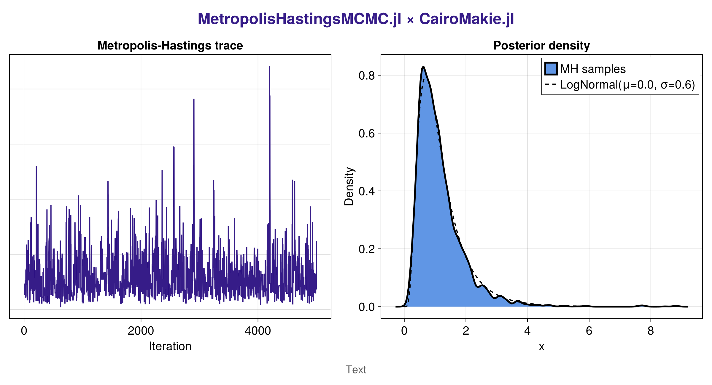

# MetropolisHastingsMCMC

`MetropolisHastingsMCMC.jl` is a compact random-walk Metropolis–Hastings sampler.
Its design mirrors [BarkerMCMC.jl](https://github.com/scheidan/BarkerMCMC.jl), retaining the `LogDensityProblems.jl` workflow while staying gradient-free thanks to plain Metropolis–Hastings proposals.

## Installation

```
] add MetropolisHastingsMCMC
```

## Usage

- Wrap an existing `LogDensityProblems.jl` model or pass a plain log-density function.
- Tune the number of iterations, initial step size `σ`, and target acceptance rate to suit your problem.

```julia
using MetropolisHastingsMCMC

log_p(x) = -0.5 * sum(x .^ 2)        # standard normal target

result = mh_mcmc(log_p, zeros(3); n_iter = 5_000)
result.samples
result.log_p
```

For a complete example with parameter transformations and automatic differentiation see the docs in `docs/src/index.md`.

## References

- N. Metropolis, A. Rosenbluth, M. Rosenbluth, A. Teller, and E. Teller (1953), *Equation of State Calculations by Fast Computing Machines*, Journal of Chemical Physics 21(6):1087–1092.
- W. K. Hastings (1970), *Monte Carlo Sampling Methods Using Markov Chains and Their Applications*, Biometrika 57(1):97–109.
- G. O. Roberts and J. S. Rosenthal (1997), *An Overview of Recent Developments in Metropolis Algorithms*, Journal of the Royal Statistical Society: Series B 59(4):781–804.

## Lognormal Demo

The `examples/lognormal_example.jl` script showcases how to sample a univariate lognormal
target distribution and visualise the resulting chain with CairoMakie.

```
julia --project=examples examples/lognormal_example.jl
```

Running the script saves a high-resolution PNG inside `examples/`. The figure pairs the
trace with a smoothed density estimate and overlays the analytic lognormal density.


